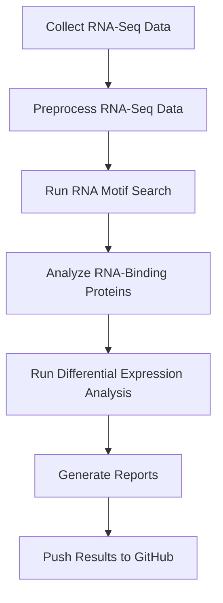

# RBP Project: RNA-Binding Protein Analysis and Delivery Design

## **Project Overview**
This project focuses on identifying RNA-binding proteins (RBPs), such as **Musashi-1 (MSI1)**, and studying their specific RNA-binding motifs (e.g., **UAGGUAG**). Our goal is to leverage these RBPs for targeted **cell-to-cell RNA delivery**, potentially modifying them to enhance RNA-binding specificity or broaden their recognition capabilities.

## **Project Goals**
1. **Identify RNA sequences and motifs** in a specific cell type that bind with RBPs, particularly **Musashi-1 (MSI1)** and **ZBP1**.
2. **Explore studies on modified RBPs** that enhance or alter their RNA-binding properties.
3. **Develop bioinformatics tools and pipelines** in Python and R to:
   - Search RNA sequences for known motifs (e.g., UAGGUAG).
   - Identify new RBPs relevant to specific RNA delivery applications.
4. **Test RNA-seq data pipelines** to predict RNA-protein interactions for custom RNA delivery systems.
5. **Incorporate GitHub version control** for efficient collaboration and tracking progress.

## **Project Plan and Milestones**

# RBP Project Workflow

### **1. Set Up the Development Environment**
- Create a project directory with the following structure:
rbp_project/ ├── data_raw/ # Raw RNA-Seq and transcript data 
             ├── data_processed/ # Cleaned and processed data 
             ├── scripts/ # Python and R scripts 
             ├── reports/ # Reports and documentation 
             ├── results/ # Figures, outputs, and results 
             └── .gitignore # Files to exclude from version control

- Install necessary tools and dependencies, including:
- **RStudio** and **R packages** (e.g., `DESeq2`, `biomaRt`, `tidyverse`)
- **Python packages** (e.g., `Biopython`, `Pandas`)
- **MEME Suite** for motif discovery

### **2. Data Collection and Preprocessing**
- Download RNA-Seq data for specific cell types from:
- GEO (Gene Expression Omnibus) or SRA
- ENCODE Project

- Preprocess the RNA-Seq data:
- Perform quality checks (FastQC)
- Align reads to reference genomes (e.g., hg38)
- Extract transcripts for motif scanning

### **3. RNA Motif Search and RBP Identification**
- Search for **Musashi-1’s UAGGUAG motif** in RNA sequences using:
- **MEME Suite (FIMO)** for motif scanning
- Custom **Python scripts** to automate motif detection

- Identify and quantify RNAs with these motifs across cell types.

### **4. Explore Modified RBPs for Improved RNA Binding**
- Review existing studies on **modifications to Musashi-1 (MSI1)** and **ZBP1** for improved specificity.
- Investigate additional RBPs with potential RNA-delivery applications.

### **5. Build Bioinformatics Pipelines in R and Python**
- Use RStudio and GitHub to:
- Implement RNA-Seq data analysis pipelines
- Create visualization tools for motif detection and expression profiling

- Write Python scripts to automate the prediction of RNA-protein interactions and motif discovery.

### **6. Results and Reporting**
- Store all results (plots, tables, etc.) in the `results/` directory.
- Write **reports** documenting findings and challenges in the `reports/` folder.
- Use **RMarkdown** for reproducible reports in RStudio.

### **7. Version Control and Collaboration**
- Commit and push all code and results to GitHub regularly.
- Track progress through **issues** and **milestones** on GitHub.
- Collaborate effectively using **pull requests** for new features and bug fixes.

## **Expected Outcomes**
1. **List of RNAs** containing the UAGGUAG motif across specific cell types.
2. **Catalog of potential RBPs** suitable for targeted RNA delivery.
3. **Custom R and Python scripts** to automate motif search and RNA analysis.
4. **Reproducible reports** documenting the findings, challenges, and future directions.
5. A well-maintained **GitHub repository** tracking the progress and version history of the project.

## **How to Contribute**
If you would like to contribute to this project, feel free to:
- Open an **issue** for bugs or feature requests.
- Fork the repository and submit a **pull request** with new code or data.

---

## **Contact Information**
Project Lead: Orry Elor  
Email: Orry.Elor@ucsf.edu
